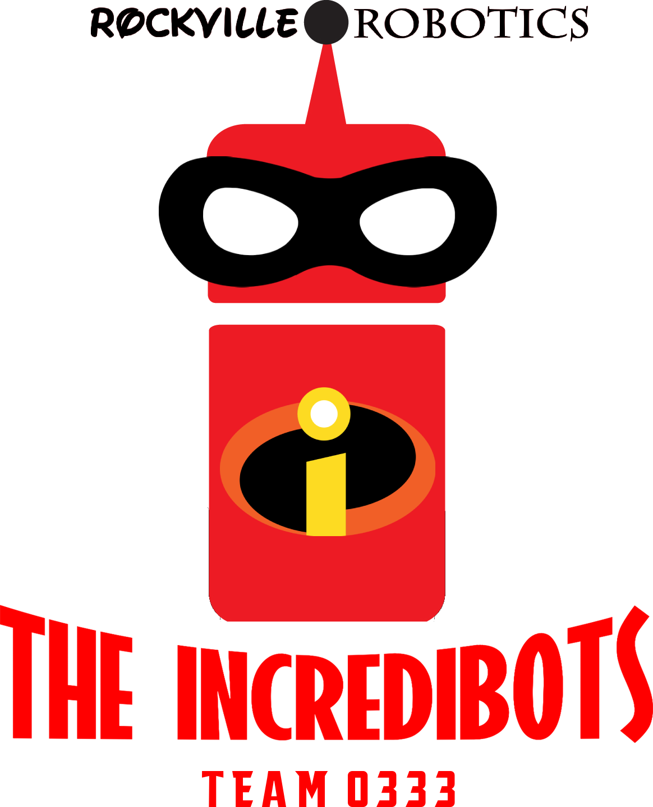
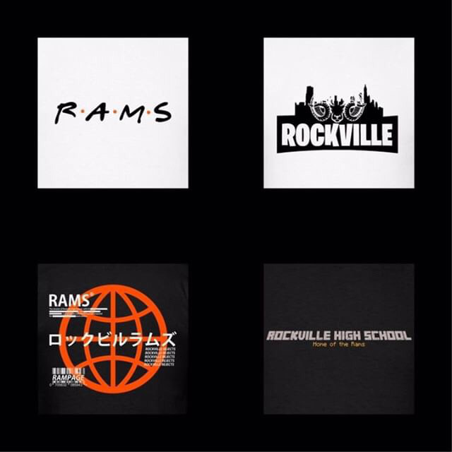

# Rockville Robotics - The Incredibots

**Team 0333**

&nbsp;&nbsp;

## [Our Code](https://github.com/RockvilleRobotics/Incredibots2019/)

We push to this GitHub repository very frequently. We utilize [Travis CI](https://travis-ci.com/) for [continuous integration](https://en.wikipedia.org/wiki/Continuous_integration) to improve our code quality.

## About Us

We are a public high school team from Rockville, Maryland in the Greater DC region. We got Third Place Overall in the Greater DC Regionals in 2019.

## Authors

Our code is written in Python 2 by Jaxon Lee, Lucas F., Tristan U., James Espericueta, Jawad Hanif, Emmet G., Xavier Y., Oliver V., Mortimer S., Michael M., and Jesse Abinsay.

## YouTube Videos
### A playlist of our regionals run can be found here:

## Builds
### Roomba Build

### Legobot Build

### Artist Credits

Our logo was designed by Theo Pauwels. Check out more of his cool designs [here](https://shop.spreadshirt.com/Rockville-Merch/).

